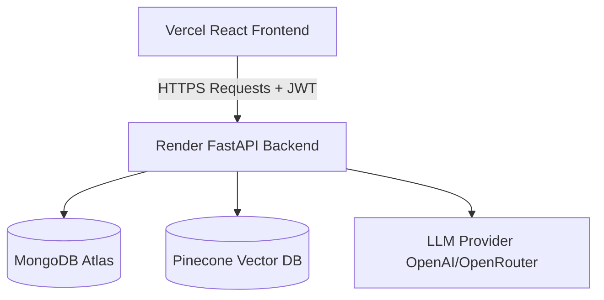

# AI Agent Builder Platform (RAG Core)

This repository serves as the production-grade Retrieval-Augmented Generation (RAG) backend and interface for the AI Agent Builder Platform. It features a fully modular Clean Architecture, a FastAPI backend, and a React + Vite + Tailwind CSS frontend.

---

## 🛠️ Tech Stack

### 1. Backend Layer
- **Framework:** FastAPI
- **Server:** Uvicorn (reload-enabled)
- **Settings Validation:** Pydantic Settings
- **RAG Orchestration:** LangChain
- **Vector Database:** Pinecone (AWS `us-east-1` serverless spec)
- **Embeddings:** HuggingFace Sentence Transformers (`all-MiniLM-L6-v2`, 384-dimensional dense vectors)
- **LLM Completion:** OpenAI / OpenRouter (supports custom base URLs and free tiers)

### 2. Frontend Layer
- **Framework:** React 19 (Single-Page Application)
- **Build Tool:** Vite
- **Styling:** Tailwind CSS v4
- **Routing:** React Router DOM
- **API Communication:** Axios Service Clients
- **Theme Support:** Class-based Light / Dark Mode

---

## 📂 Project Structure

```
rag-foundation/
├── backend/                  # Production FastAPI application
│   └── app/
│       ├── main.py           # Startup checks, CORS, and central exception maps
│       ├── api/              # Route endpoints (chat, upload, health checks)
│       ├── services/         # Layered service providers (embedding, vectorstore, LLM, RAG)
│       ├── repositories/     # Repository patterns tracking ingestion & latencies
│       └── core/             # Central configs, JSON logs, exceptions, and dependency caching
├── frontend/                 # Single-Page React application
│   ├── src/
│   │   ├── layouts/          # Dashboard subrouting & theme context frames
│   │   ├── pages/            # Chat interface & Document ingestion views
│   │   ├── services/         # Ingestion and query API clients (Axios)
│   │   └── components/       # UI elements (PDF uploader, chat bubbles, sidebar, progress bar)
│   ├── package.json          # Node scripts and dependencies
│   └── vite.config.js        # Vite configurations
└── src/                      # Legacy RAG base utilities
```

---

## 🚀 Running Locally

### 1. Configuration Setup
Create a `.env` file at the root of the project:
```env
OPENAI_API_KEY="your-api-key"
PINECONE_API_KEY="your-api-key"
PINECONE_INDEX_NAME="rag-production"

# Optional: Configuration for OpenRouter free tier
OPENAI_API_BASE="https://openrouter.ai/api/v1"
LLM_MODEL_NAME="openrouter/free"
```

### 2. Start the Backend API
```bash
python -m uvicorn backend.app.main:app --port 8080 --reload
```

### 3. Start the React Frontend
```bash
cd frontend
npm install
npm run dev
```
Open `http://localhost:5173` in your browser.

---

## 🌐 Production Deployment

This section describes how to deploy the platform to production.

### 🏗️ Architecture Flow Chart



### 🖥️ Frontend Deployment (Vercel)

1. **Push to Repository**: Push the repository containing the `frontend` workspace to GitHub.
2. **Connect Vercel**: Connect your GitHub account to Vercel and import the project.
3. **Configure Settings**:
   - **Framework Preset**: `Vite`
   - **Root Directory**: `frontend`
4. **Environment Variables**: Add the following Environment Variable in Vercel:
   - `VITE_API_BASE_URL`: The URL of your live Render backend (e.g., `https://your-backend.onrender.com`).
5. **Deploy**: Click **Deploy**. Vercel will build the SPA, and the routing is managed securely via `vercel.json` rewrites.

### ⚙️ Backend Deployment (Render - Native Python)

1. **Connect Render**: Connect your GitHub repository to Render and create a new **Web Service**.
2. **Configure Build & Start Settings**:
   - **Runtime**: `Python 3`
   - **Build Command**: `pip install -r requirements.txt`
   - **Start Command**: `uvicorn backend.app.main:app --host 0.0.0.0 --port $PORT`
3. **Environment Variables**: Set the following variables in the Render dashboard:
   - `MONGODB_URI`: Your MongoDB Atlas URI.
   - `DATABASE_NAME`: `rag_platform`
   - `PINECONE_API_KEY`: Your Pinecone API Key.
   - `PINECONE_INDEX_NAME`: Your Pinecone Index.
   - `OPENAI_API_KEY`: Your OpenAI/OpenRouter API Key.
   - `OPENAI_API_BASE`: `https://openrouter.ai/api/v1` (if using OpenRouter).
   - `JWT_SECRET_KEY`: A secure random cryptographic key for production.
   - `ALGORITHM`: `HS256`
   - `FRONTEND_URL`: Your Vercel frontend URL (e.g., `https://your-app.vercel.app`) to authorize CORS access.
4. **Deploy**: Click **Deploy**. Render will install the dependencies, start the FastAPI server on native Python, and map it automatically to the assigned `$PORT`.
